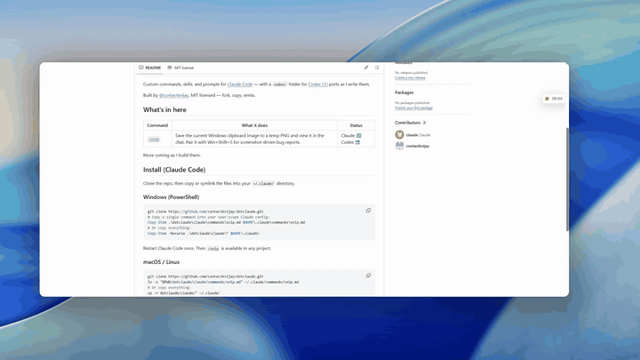

# dotclaude

**Show, don't describe.**

The fastest way to ask Claude about anything you can see.

You're staring at a weird error. A broken layout. A chart that doesn't add up. You *could* try to put it into words. Or you could just show.

`/snip` makes showing as easy as asking.

Custom commands, skills, and prompts for [Claude Code](https://claude.com/claude-code) — with a `codex/` folder for [Codex CLI](https://github.com/openai/codex) ports as I write them. Built by [@contactkvijay](https://github.com/contactkvijay). MIT licensed — fork, copy, remix.

## Before `/snip`

You see something you want Claude to look at. Here's the dance:

1. **Win+Shift+S.** Drag a box around it.
2. Click "Save" on the little notification.
3. Pick a folder. Type a filename. Save.
4. Open File Explorer. Hunt for the file.
5. Switch back to Claude.
6. Drag the file into the chat box.
7. *Now* type your question.

Seven steps. By step five, you've forgotten what you wanted to ask.

So most days, you skip the screenshot. You try to describe the bug in words. Claude guesses. You both waste time.

## After `/snip`

1. **Win+Shift+S.** Drag a box around it.
2. Type `/snip what's wrong here?`
3. Claude saves the picture and answers.

That's it.

No folder to pick. No filename to invent. No dragging. The picture lands in a temp folder with a timestamp name like `snip-20260513-093200-742.png` — out of sight, out of mind.

## Demo



## What's in here

| Command | What it does | Status |
|---|---|---|
| [`/snip`](./claude/commands/snip.md) | Save the current Windows clipboard image to a temp PNG and view it in the chat. Pair it with Win+Shift+S for screenshot-driven bug reports. | Claude ✅ &nbsp; Codex 🔜 |

More coming as I build them.

## Install (Claude Code)

Clone the repo, then copy or symlink the files into your `~/.claude/` directory.

### Windows (PowerShell)

```powershell
git clone https://github.com/contactkvijay/dotclaude.git
# Copy a single command into your user-scope Claude config:
Copy-Item .\dotclaude\claude\commands\snip.md $HOME\.claude\commands\snip.md
# Or copy everything:
Copy-Item -Recurse .\dotclaude\claude\* $HOME\.claude\
```

Restart Claude Code once. Then `/snip` is available in any project.

### macOS / Linux

```bash
git clone https://github.com/contactkvijay/dotclaude.git
ln -s "$PWD/dotclaude/claude/commands/snip.md" ~/.claude/commands/snip.md
# Or copy everything:
cp -r dotclaude/claude/* ~/.claude/
```

> **Project-scoped vs. user-scoped:** copying into `~/.claude/commands/` makes the command available everywhere. Copying into a project's `.claude/commands/` limits it to that project. Pick whichever fits.

## Install (Codex CLI)

Codex uses `~/.codex/prompts/*.md` (plain markdown, no YAML frontmatter, no per-command tool allowlist). Ports live under `codex/` here as I write them. The `snip` port is not done yet — coming after I verify it on a real Codex install.

## Is this Claude-only?

The *idea* of slash commands ports across CLIs; the *file format* doesn't.

- **Claude Code**: YAML frontmatter (`allowed-tools`, `argument-hint`), `$ARGUMENTS` substitution, project- or user-scoped under `.claude/commands/`.
- **Codex CLI**: plain markdown under `~/.codex/prompts/`, no frontmatter, different argument convention, shell access works through Codex's own sandboxing.

The PowerShell snippet inside `/snip` runs under either CLI — only the wrapper changes. That's why this repo separates `claude/` from `codex/` instead of mixing them.

## Contributing / forking

Open an issue or PR, or just fork it. If you adapt a command for another CLI (Cursor, Aider, etc.), open a PR with a new top-level folder — happy to host ports.
